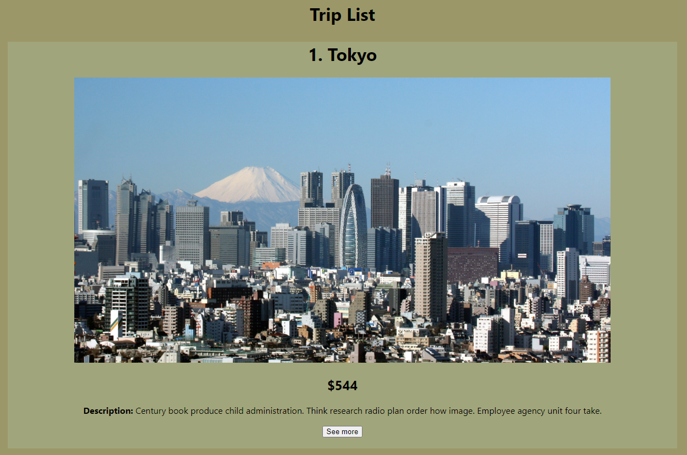
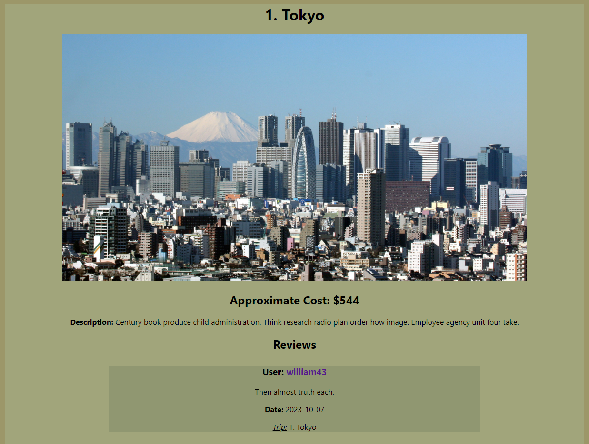
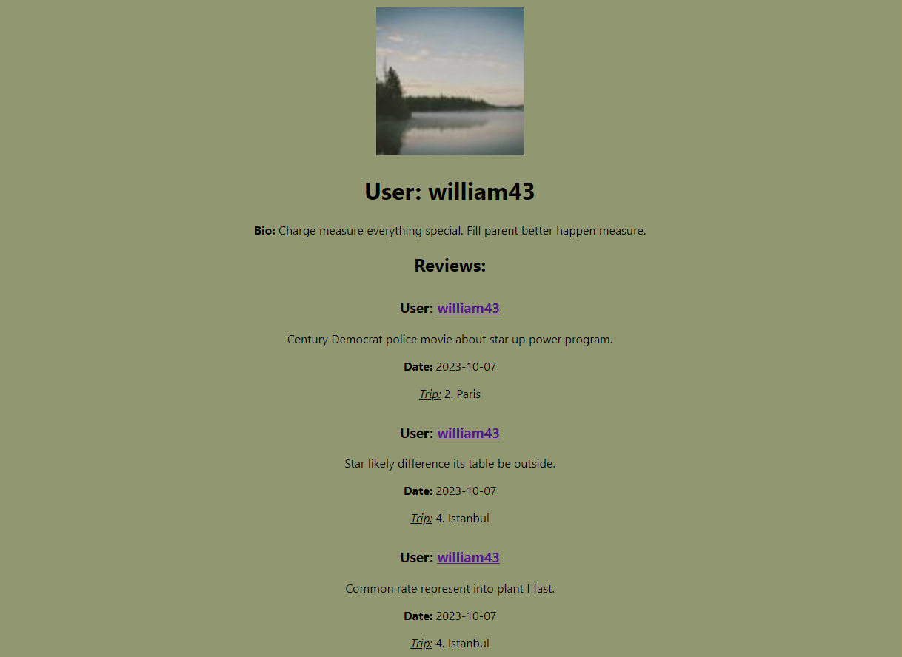
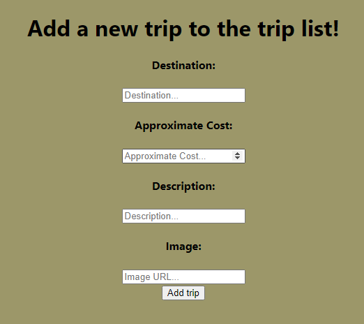
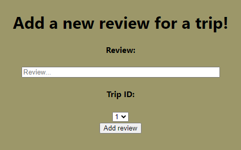
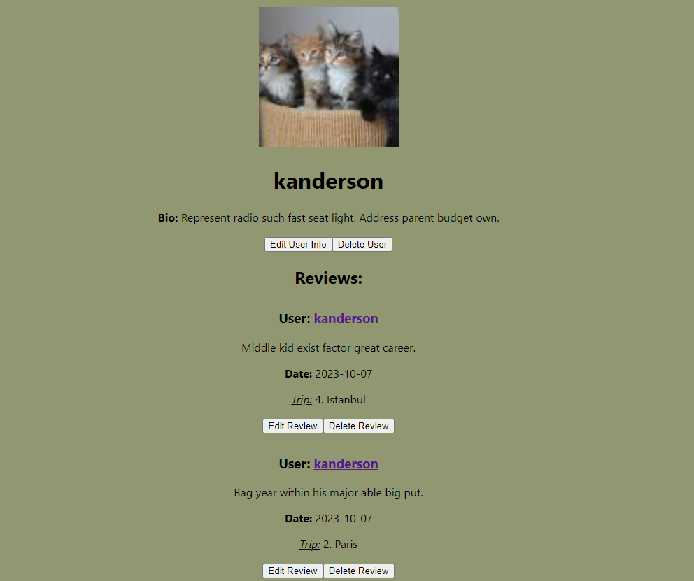

# Phase 5 Full-Stack Application - Journey Journal

## What is Journey Journal?

Journey Journal is a full stack project web application. The front-end and back-end were created within this repository.
It is a simple web application that prompts users to log in or make an account on startup. From there users can view trips 
that are already added to the database. Users can see related reviews to each trip along with the user that created the 
review. Users can also see a collection of another user's reviews. Users can also create new reviews for existing trips. 
Users can also add a new trip to the database. Users can also log out, delete reviews, and even delete their account. 
You can easily navigate throughout the application via the navigation bar in the top of the page. 


## Usage

Fork and clone this repository to your computer. Then `cd` into the server directory and run `pipenv install; pipenv shell` 
in your terminal. Then `cd` into the client directory and run `npm install`. Open another terminal and `cd` into the server/
directory. Then run `python seed.py` to populate the database. Then run `flask run` to startup the server.  In the first terminal, 
run `npm start` in the client directory. 


## File Structure Breakdown

### Server

```console
$tree -L 1
.
├── __pycache__
├── app.py
├── config.py
├── instance
├── migrations
├── models.py
└── seed.py
```
#### Models

The models file uses `SerializerMixin` for model serialization and `hybrid_property`
for use in password hashing. The models described in this file file are `User`, `Review`,
and `Trip`. These will be used to create the database tables. 

#### Seed 
The seed file uses the `Faker` library and the `random` library for use in seed data. 
It begins by clearing the database. It then uses a loop to create 10 users with all data
created using the `Faker` library. 

#### App
The app file is where all the backend resources are contained. It contains the structure
for backend to receive requests to specified endpoints and definitions for which request
methods are accepted for each resource. 

### Client/src

```console 
$tree -L 2

.
├── components
│   ├── App.js
│   ├── Home.js
│   ├── LoginForm.js
│   ├── NavBar.js
│   ├── NewReview.js
│   ├── NewTrip.js
│   ├── Review.js
│   ├── SignupForm.js
│   ├── SignupLogin.js
│   ├── Trip.js
│   ├── TripList.js
│   ├── TripReviews.js
│   ├── UserPage.js
│   └── UserReviews.js
├── index.css
└── index.js
```

#### App
This is where the app actually renders each route. Included routes are: `Homepage`, `SignupLogin`, `TripList`, `TripReviews`, `UserReviews`, `NewTrip`, `NewReview`, `UserPage`.

The homepage renders the simple homepage as a welcome if already logged in. If not logged in, it instantly redirects you to the login page. The trips route shows all the trips in the database as well as it's basic information. Each trip has a see more button that, when pressed, redirects you to the trip reviews route. This page shows the trip as well as any related reviews to the trip and the username that created the review. Each username is a link that, when pressed, redirects to the user reviews route. This shows the users information as well as all the reviews they have created. All routes are intuitively accessed through basic user interaction. The most simple being the navigation bar. 

#### Home

Very basic homepage that welcomes users and gives them a basic idea of the web application. See image above for reference. 

#### Signup/Login

This component is the first that users are met with upon starting the application. In the `App` component, a fetch request is sent to `check_session`. If users are logged in, the app will render the homepage and if not logged in, the users are brought to the login page. This page will display the `LoginForm` component. If you do not have an account, there is a button called 'Sign Up' that when pressed will change the render to show the `SignupForm` component. 


#### Navbar

The `Navbar` component is very simple. A navigation bar with links to different routes within the application. Additionally, there is a logout button that, as the name states, will log users out. There is also a link with the user's username that can be pressed to access the UserPage route.  

#### TripList

This component shows the user the trips that are in the database. Each trip has a see more button that, when pressed, redirects you to the trip reviews route. 



#### TripReviews

This component shows the trip as well as any related reviews to the trip and the username that created the review. Each username is a link that, when pressed, redirects to the user reviews route.



#### UserReviews

This component shows the users information as well as all the reviews they have created. 



#### NewReview & NewTrip

These components are both forms in which users can add a new review to an already existing trip or add a new trip entirely.

 

#### UserPage

This component is where users can view their information and reviews they have created. It gives them the ability to edit each review as they see fit or edit their user information such as their bio or user image. They also have the ability to delete their account or thei reviews. 




## Resources

[Github Docs - Licensing a Repository](https://docs.github.com/en/repositories/managing-your-repositorys-settings-and-features/customizing-your-repository/licensing-a-repository)